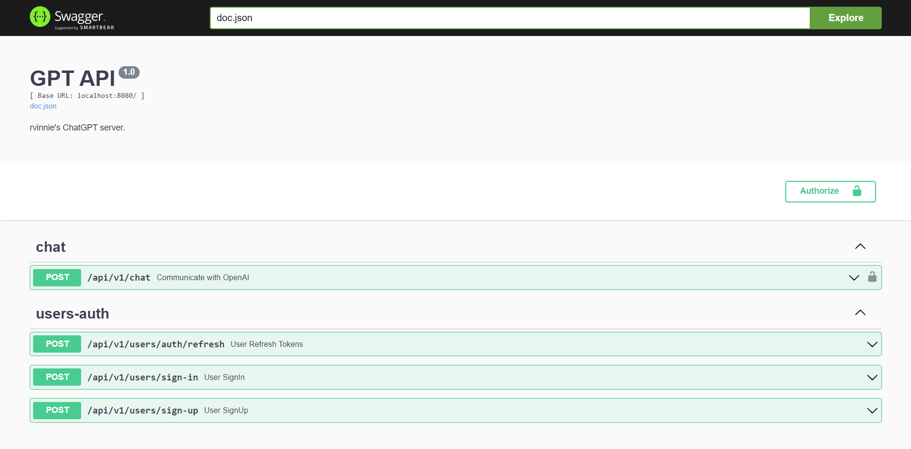

<a name="readme-top"></a>
<!-- PROJECT LOGO -->
<br />
<div align="center">
<h1 align="center">gpthub-backend</h1>
    <p align="center">
        <a href="https://github.com/HubCreators/gpthub-backend/issues">Report Bug</a>
        ·
        <a href="https://github.com/HubCreators/gpthub-backend/issues">Request Feature</a>
        <br />
        <br />
        
    </p>
</div>


<!-- TABLE OF CONTENTS -->
<details>
  <summary>Table of Contents</summary>
  <ol>
    <li><a href="#about-the-project">About The Project</a></li>
    <li><a href="#getting-started">Getting Started</a>
      <ul>
        <li><a href="#installation">Installation</a></li>
      </ul>
    </li>
    <li><a href="#usage">Usage</a></li>
    <li><a href="#roadmap">Roadmap</a></li>
    <li><a href="#contributing">Contributing</a></li>
    <li><a href="#contact">Contact</a></li>
  </ol>
</details>

## About The Project

This project is a backend implementation of a Chat GPT mirror (Monolithic Architecture)

Technologies used:
* [Golang](https://go.dev/), [PostgreSQL](https://www.postgresql.org/)
* [REST](https://ru.wikipedia.org/wiki/REST), [Swagger UI](https://swagger.io/tools/swagger-ui/)
* [JWT Authentication](https://jwt.io/)
* [OpenAI](https://openai.com/blog/openai-api)

<!-- GETTING STARTED -->
## Getting Started

This is an example of how you may give instructions on setting up your project locally.
To get a local copy up and running follow these example steps.

### Installation

1. Clone the repo
   ```sh
   git clone https://github.com/HubCreators/gpthub-backend
   ```
2. Set environment variables in application root (`.env`)
   ```sh
   DB_PASSWORD=<postgres password>
   PASSWORD_SALT=<password salt>
   JWT_SIGNING_KEY=<JWT secret key>

   OPEN_API_KEY=<OpenAI secret key>

   GIN_MODE=debug
   ```
4. Compile and build the project
   ```sh
   make
   ```

<p align="right">(<a href="#readme-top">back to top</a>)</p>

<!-- USAGE -->
## Usage

After launch, go to the address in the browser
`http://localhost:8080/docs/index.html`



Here you can register a user and get a JWT access token.  
Next, add the `Authorization` header with the value `Bearer <your access token>` on every request (use `Authorization` button)

Authorized users can send requests to GPT chat by sending requests to `/api/v1/chat`.

At the moment, only the ability to communicate with the ChatGPT is implemented, but in the future it is planned to add template prompts that add more context to the chat request.
<p align="right">(<a href="#readme-top">back to top</a>)</p>

<!-- ROADMAP -->
## Roadmap

- [ ] Implement ChatGPT request method with context
- [ ] Add logic for working with the mail service
- [ ] Add logic for admin "panel"


See the [open issues](https://github.com/HubCreators/gpthub-backend/issues) for a full list of proposed features (and known issues).

<p align="right">(<a href="#readme-top">back to top</a>)</p>

<!-- CONTRIBUTING -->
## Contributing

Contributions are what make the open source community such an amazing place to learn, inspire, and create. Any contributions you make are **greatly appreciated**.

If you have a suggestion that would make this better, please fork the repo and create a pull request. You can also simply open an issue with the tag "enhancement".
Don't forget to give the project a star! Thanks again!

1. Fork the Project
2. Create your Feature Branch (`git checkout -b feature/AmazingFeature`)
3. Commit your Changes (`git commit -m 'Add some AmazingFeature'`)
4. Push to the Branch (`git push origin feature/AmazingFeature`)
5. Open a Pull Request

<p align="right">(<a href="#readme-top">back to top</a>)</p>

<!-- CONTACT -->
## Contact

Alexey Fedoseev - [@fedoseev_alexey](https://t.me/fedoseev_alexey) - rv1nnie@yandex.ru

Project Link: [gpthub-backend](https://github.com/HubCreators/gpthub-backend)

<p align="right">(<a href="#readme-top">back to top</a>)</p>